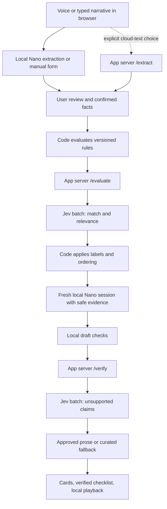

# Architecture and contracts

## Chosen implementation baseline

Use TypeScript throughout, React with Vite for the browser, a Node server with Fastify for same-origin JSON routes, Zod for runtime request/response validation, Vitest for unit/integration tests, and Playwright for the few browser journeys. This stack is a PRD design choice, not a constraint from the brief. Select maintained compatible versions during P1-01, record them, and commit a lockfile. Do not add a database, auth system, vector search, queue service, or generic agent framework for this scope.

Serve the built client and `/api/*` from one HTTPS origin. Development uses a Vite proxy to the server. Keep Jev/server files outside the client dependency graph. Only capability probes and local model/speech adapters may access experimental browser globals.

```text
src/
  client/{app,components,hooks,state,styles}/
  client/adapters/{nano,speech,playback,manual,cloud}.ts
  shared/{contracts,schema,normalization,screening,ranking}.ts
  shared/catalog/{manifest,programs,sources}/
  server/{index,config,limits,logging}.ts
  server/routes/{evaluate,verify,extract,explain,health}.ts
  server/jev/{client,policy,validate}.ts
  server/cloud/{provider,schemas}.ts
scripts/{validate-catalog,check-links,test-affected}.ts
tests/{unit,integration,e2e,fixtures,evals}/
docs/{decisions,progress,evidence,release}/
```

## Data flow and trust boundaries



Server recomputes deterministic checks from validated facts and its own catalog; it never trusts client-supplied rule outcomes. Catalog bundles in browser and server share a hash. `/evaluate` and `/verify` are the two normal Jev batches; static asset loads, model downloads, health checks, retries and cloud fallback are separate network activity. “Two calls total” is not a privacy or performance guarantee.

## State machine and cancellation

`welcome → capabilityCheck → intake → extracting → reviewing → clarifying? → evaluating → composing → verifying → results`.

Each stage may enter a recoverable error/fallback state. `reset` returns to intake from any stage. Use a monotonically increasing `revision` per edit/reset; only results for the active revision can update UI. Abort previous fetches and prompts; ignore late speech events. Errors preserve current text/facts unless the person resets. Back from results preserves local facts for correction; re-evaluation discards stale generated prose and plan checks.

Capability status is independent: `{nano, localSpeech, localVoice, online, cloudEnabled}`. Do not collapse these into a single supported-browser boolean. A browser can support local voice but not Nano, or Nano but no microphone access.

## Fact model

Missing is `null` / unknown, never `0` or `false`. Keep original source spans and unreviewed amounts in browser memory only. Submit only user-reviewed income intervals; default to coarse intervals, with a confirmed exact amount represented as a point interval only when the person deliberately chooses it. Disclose these as household details, never as anonymous data. User-confirmed facts outrank model proposals. Do not infer Medicare from age, dependents from household size, pregnancy from gender, or residency from browser locale.

```ts
type Tri = 'yes' | 'no' | 'unknown';
type ProgramId = 'snap' | 'wic' | 'medicare_help' | 'lifeline' | 'eitc' | 'ceap';
type MoneyInterval = { minCents: number; maxCents: number | null };
type Facts = {
  need: 'food' | 'tax' | 'utilities' | 'medicare' | 'phone' | 'unspecified';
  state: 'TX' | 'other' | null;
  householdSize: number | null; // integer 1..20, >20 uses assisted/manual referral
  foodHouseholdSize: number | null; // SNAP purchasing/preparing group
  income: { interval: MoneyInterval; period: 'weekly' | 'biweekly' |
    'semimonthly' | 'monthly' | 'annual'; basis: 'gross' | 'net' | 'unknown' } | null;
  ageBand: 'under18' | '18to59' | '60to64' | '65plus' | null;
  employment: 'employed' | 'selfEmployed' | 'unemployed' | 'retired' | 'other' | null;
  medicarePartA: Tri; pregnant: Tri; postpartumUnder6Months: Tri;
  breastfeedingUnder12Months: Tri; childUnder5: Tri;
  receivesSnap: Tri; receivesMedicaid: Tri; receivesSsi: Tri; receivesTanf: Tri;
  receivesHousingAid: Tri; receivesVeteransPension: Tri; existingLifeline: Tri;
  sharesFood: Tri; resourcesKnown: Tri;
};
type CriterionResult = {
  id: string; status: 'pass' | 'fail' | 'unknown' | 'notApplicable';
  evidenceIds: string[]; reasonCode: string;
  blocksLikely: boolean; // authored in catalog, not inferred by a model
};
```

Implement runtime bounds, nullable enums, strict objects and maximum array lengths in a single Zod contract package. Derive JSON Schema for Nano from the same schema. An empty boolean answer is unknown. Mutually inconsistent facts produce a clarification, not arbitrary overwriting. `resourcesKnown` does not assert resources meet limits: MSP stays incomplete until that subprogram's structured resource test is implemented.

Program-specific extensions are separate schemas: MSP individual/couple and countable-income/resource bands; WIC category-specific household and expected births; EITC tax year, filing status, earned income/AGI bands, qualifying-child count, investment-income status and exception flags; CEAP county and household utility responsibility. Collect only the extension fields needed by enabled programs. Do not forward raw county/address when a state-level referral suffices.

### Program extension contract

Use this explicit wire shape alongside `facts`; every property is required with nullable/unknown values. The common schema cannot express every program's household or income definition. Never substitute a common gross-income amount for tax-year AGI or agency countable income. Questions about unfamiliar definitions offer “Not sure” and an official help path.

```ts
type ProgramExtensions = {
  snap: {
    olderOrDisabled: Tri;
    snapExceptionStatus: 'applies' | 'doesNotApply' | 'unknown';
    deductionsAssessed: Tri;
    countableNetMonthly: MoneyInterval | null;
  };
  eitc: {
    taxYear: number | null; // allowed years are the catalog's published year enum
    filingStatus: 'single' | 'headOfHousehold' | 'joint' | 'separate' |
      'survivingSpouse' | 'unknown';
    earnedAnnual: MoneyInterval | null;
    agiAnnual: MoneyInterval | null;
    qualifyingChildrenCount: 0 | 1 | 2 | 3 | null; // 3 means confirmed 3+
    investmentIncomeWithinLimit: Tri;
    childlessAge25to64: Tri;
    specialRuleApplies: Tri;
    childlessResidenceAndDependencyChecks: Tri;
  };
  ceap: {
    utilityResponsibility: Tri;
    needsHeatingCoolingHelp: Tri;
    householdDefinitionConfirmed: Tri;
    // County stays local; the official finder accepts it outside this API.
  };
  medicare: {
    partBID: Tri;
    category: 'individual' | 'couple' | 'unknown';
    countableMonthly: MoneyInterval | null;
    countableResources: MoneyInterval | null;
    countableBasisConfirmed: Tri;
    receivesOtherMedicaid: Tri;
    receivesMsp: Tri;
    receivesFullMedicaid: Tri;
    extraHelpAnnualIncome: MoneyInterval | null;
    extraHelpResources: MoneyInterval | null;
    extraHelpBasisConfirmed: Tri;
    specialPathwayReviewNeeded: Tri;
  };
  wic: {
    applicableHouseholdSize: number | null;
    expectedInfants: number | null;
    householdBasisConfirmed: Tri;
  };
  lifeline: {
    economicHouseholdSize: number | null;
    householdBasisConfirmed: Tri;
    specialPathwayReviewNeeded: Tri;
  };
};
```

Common facts provide the WIC category flags and Lifeline participation enum flags. Unsupported participation/exception categories remain a referral until explicitly added and sourced. Medicare resource amounts are countable bands, not account balances collected item by item. A confirmed countable basis is necessary for using those bands; otherwise that criterion is unknown. Additional predicates discovered during source review must be added to this versioned contract, prompts, manual form, network allowlist and fixtures together.

Runtime validation: amounts are nonnegative safe integer cents, capped at 1,000,000,000 cents for input sanity; finite upper endpoint must be ≥ lower endpoint, null upper endpoint means open-ended. Household fields are integers 1–20 or null; expected infants 0–10 or null. Out-of-range values produce a correction or assisted referral, never silent clamping. The common age band is insufficient for the EITC childless rule, which is why its separate age predicate exists.

## Money, dates and rules

Use integer cents for stored amounts; do calculations with exact integer/rational arithmetic. Annual factors: weekly ×52; biweekly ×26; semimonthly ×24; monthly ×12. Conversions are preliminary screening conventions; use an agency-specific conversion when its rule requires one. Never treat “twice monthly” as biweekly.

Compare interval endpoints to a same-period, same-basis threshold. If the entire interval satisfies a verified criterion, pass; if wholly outside a complete, applicable rule, fail; if overlapping or the basis/period/definition is unknown, unknown. A bare gross-income limit is not sufficient for an absolute SNAP exclusion when exceptions apply. Preserve uncertainty and known exclusions in `CriterionResult`.

Select rules using an injected evaluation date and explicit jurisdiction/tax year. Dates use ISO calendar dates; handle boundaries in jurisdiction-local date, not an accidental UTC rollover. A fetched date is not an effective date.

## Browser → server API

All routes accept JSON only, use strict allowlists, reject unknown properties, set `Cache-Control: no-store`, and never include personal input in logs/error text. Initial bounds: 32 KiB request bodies, 6 programs, 3 explanation sentences per program, 200 characters per sentence, 6 checklist items per program. These are application limits; do not cite them as vendor limits. Same-origin checks, restrictive CORS, a 30 requests/minute anonymous rate limit and a per-server concurrency cap of 8 are initial deployment choices; tune with measurement. Use short-lived, salted rate-limit keys rather than logging raw IPs with content.

| Route | Request | Response / behavior |
|---|---|---|
| `GET /api/health` | None | `{ready, catalogVersion, jevConfigured, cloudConfigured}`; no key, upstream body or user data; configuration does not imply a successful live call |
| `POST /api/evaluate` | `{schemaVersion:'1', revision, catalogVersion, facts, extensions, programIds}` | `{revision, catalogVersion, rulesVersion, evaluationToken, model, engine:'jev'\|'rules', results, questionVersion, policyVersion}` |
| `POST /api/verify` | `{schemaVersion:'1', revision, catalogVersion, evaluationToken, drafts:[{programId,sentences:[{id,text,evidenceIds}],checklist:[{id,text,evidenceIds}]}]}` | `{revision, engine, programs:[{programId,status:'approved'\|'fallback',approvedSentenceIds,approvedChecklistIds,reasonCodes}],model}` |
| `POST /api/extract` | Cloud enabled only: `{schemaVersion:'1', revision, text, consent:'cloud-text-v1'}` | Validated fact proposals; no echo of transcript; unavailable/declined uses manual form |
| `POST /api/explain` | Cloud enabled only: `{schemaVersion:'1', revision, catalogVersion, evaluationToken, programIds, consent:'cloud-text-v1'}` | Draft sentences and checklist items from server-selected evidence, subsequently sent to `/verify` |

`results[]` contains `programId`, preliminary `label`, `criteria`, `reasonIds`, `missingFieldIds`, optional model score/confidence (debug metadata only), `rank`, and `valueEvidenceId`. No model-generated URLs or document names.

`evaluationToken` is a signed, expiring token (15-minute TTL) over the minimal normalized evaluation snapshot, catalog hash, allowed evidence IDs, revision and engine. It is integrity protection, not encryption. Keep it in memory, never in URLs, cookies, analytics or logs. Prefer storing only derived criterion statuses rather than raw monetary facts in it. `/verify` verifies signature/expiry and reconstructs evidence from the server catalog; it must not accept arbitrary client-provided claims as authoritative evidence. A new deployment with a new signing key safely expires prior tokens. Missing/expired token returns `409 reevaluate_required`.

Errors: `400 invalid_request`, `413 too_large`, `409 catalog_changed|reevaluate_required`, `429 busy`, `503 provider_unavailable|not_configured`, `504 timed_out`. Supply a safe user action and correlation ID. Jev failure may return a successful rules-mode evaluation with `engine:'rules'`; invalid client requests must never silently become successful fallback results.

## Privacy and operational constraints

Local mode: raw audio/transcript/source spans stay in browser memory. `/evaluate` contains only reviewed allowlisted facts; `/verify` contains sanitized generated sentences and approved IDs. A fresh explanation session sees only an evidence snapshot, never the intake session's history. A privacy scan and strict sentence schema run before `/verify`; suspicious drafts are replaced locally by curated text. This reduces exposure, but is not a guarantee that arbitrary personal text is anonymous.

Cloud mode: text is sent to the app server and configured language provider after explicit choice. Explain the changed boundary before the request. No audio upload in this release. Do not silently switch Web Speech to its online mode. Non-consenting users use the manual form and curated text.

No transcript/fact persistence, session replay, third-party analytics, external font requests, or personal values in URLs. Only theme preference may use localStorage. Content-free metrics may include duration, status, engine, catalog/model/prompt versions and token counts. Disable provider debug bodies and platform request-body logging. Reset clears application memory, not downloaded browser models or external provider retention.

Keep `TYPESAFE_API_KEY`, optional `ANTHROPIC_API_KEY`, and `EVALUATION_SIGNING_SECRET` server-side in environment/secret storage. `.env.example` contains empty values only. No `VITE_` prefixed secret. The supplied key is deliberately absent from this PRD; configure it outside source control and rotate the chat-shared value before public deployment.
